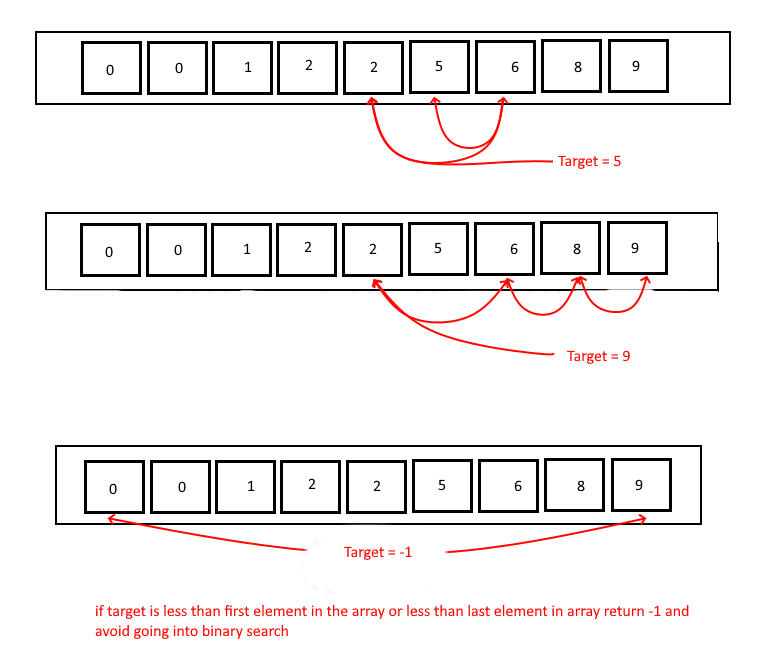

# Binary Search of Sorted Array
- Write a function called BinarySearch which takes in 2 parameters: a sorted array and the search key. Without utilizing any of the built-in methods available to your language, return the index of the array’s element that is equal to the value of the search key, or -1 if the element is not in the array.

## Algorithm

Create a function that accepts two parameters. Set start value to 0. Set end value to the index at the end of the array. Iterate through the array until found the search key. 

## Pseudocode

```plaintext

function binarySearch (array, searchKey)
  
  declare start <- 0;
  declare end <- arr.length - 1;
  if arr[start] > searchKey OR arr[end] < searchKey:
    return -1;
  while start <= end:
    declare middle <- (start + end) / 2;
    if arr[middle] === searchKey:
      return middle;
    if arr[middle] < target:
      start = middle + 1;
    if arr[middle] > target:
      end = middle - 1;
  return -1;

```
## Whiteboard img


