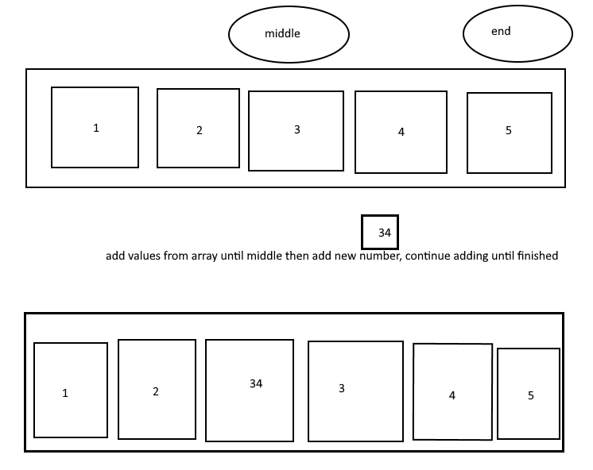

# #Insert Shift Array
- Write a function which takes in an array and a value to be added.

## Algorithm
Use a for loop to look at all the elements in the array. (Iterate through the array).
Find array length and add 1 to it. Iterate and stop at the middle. Find index at middle spot of array. Add value.

## Pseudocode

```plaintext

function InsertShiftArray takes in 'arr' and 'num':

  declare tempArr <- arr[arr.length + 1]
  declare middle <- tempArr.length/2

  for tempArr.length, i++:
    if i < middle:
      tempArr[i] = arr[i]
    else if i == middle:
      tempArr[i] = num
    else:
      tempArr[i] = arr[i-1]
  
  return tempArr

```

## Whiteboard
