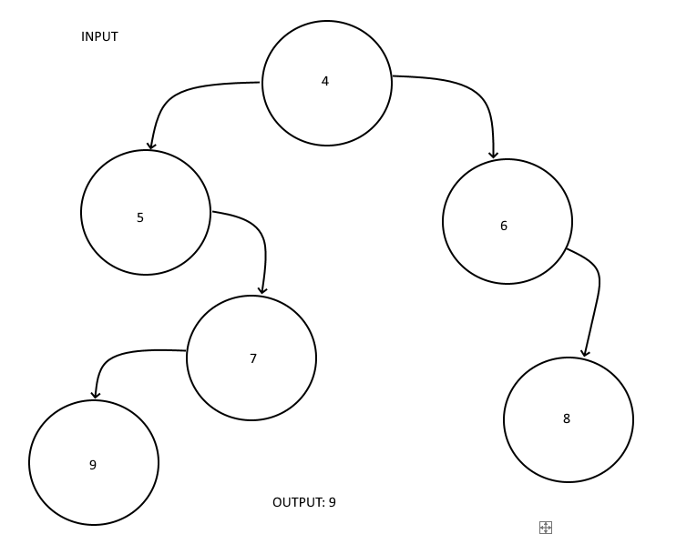
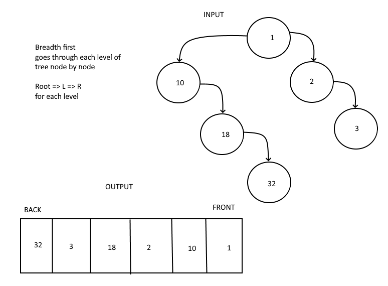

# Trees

## Problem Domain

### Challenge 15

Create a Binary Tree class
Define a method for each of the depth first traversals:
- pre order
- in order
- post order which returns an array of the values, ordered appropriately.

Binary Search Tree

Create a Binary Search Tree class
This class should be a sub-class (or your languages equivalent) of the Binary Tree Class, with the following additional methods:
Add- Adds a new node with that value in the correct location in the binary search tree.
Contains- Returns a boolean indicating whether or not the value is in the tree at least once.

### Challenge 16

Find the maximum value in a binary tree

UML: 

## Challenge 17

Write a function called breadth first
list of all values in the tree, in the order they were encountered

